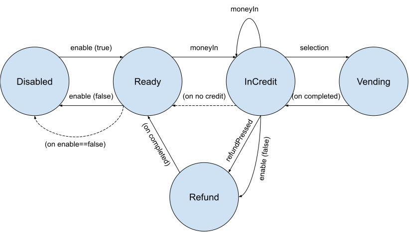

# Finite State Machine for Flutter/Dart

Although we try to avoid it as much as possible, there are times when our programs must manage modalities.  Examples are:

- **Modal views:** A view may enable or disable controls as you move through some process;
- **Wizards:** You may have a succession of forms, where the previous answers control what is shown subsequently;
- **Outboard modalities:** You may have a user-onboarding process, where certain documentation must be uploaded and verified (remotely) before the user is allowed to progress further.

One way of handling this complexity is to have lists of conditions describing what is possible when.  A better way is to name each mode, and attach the conditions to the mode itself.

> The computer-science term for this is a "Finite State Machine", and if you're interested there are lots of resources online which explain it in whatever detail you wish.

## Features

This package will allow you to build a finite state machine with which you can control the modalities of your app or process to whatever detail you wish.  Using a package like this means:

- There is a clear separation between logic and client. 
- The logic is clear and simple.  It makes very clear in your code exactly what you want to happen, when, and why.  The logic is easily testable, easly extendable, and very simple to read.
- The associated client (whether that's a UI or some other behaviour) is also very simple: all the control logic is abstracted to the state machine.

## The least you need to know:

Briefly, a finite state machine comprises:

- A collection of **States** - the machine is 'in' exactly one state at any time;
- A collection of rules by which the machine transitions from state to state.
- Additionally (to make the theory useful to us), each state contains a collection of **Properties**, which the machine doesn't use but which you can inspect.

Here's a simple vending machine expressed as a finite state machine:



As you can see, there are five states the machine can be in.  The machine moves from state to state in response to either:

- Some action by an operator (the engineer enables the machine for use, the user inserts money);
- Some event internal to the machine (the refund process has completed). Internal transitions are labelled (in parentheses).

One more thing: when the machine enters the `InCredit` state, there may be no remaining credit, in which case the machine will automatically generate a transition to the `Ready` state.  These are called redirections, and are encoded by dotted arcs.

## Usage

First, import the package into your source file:

```dart
import 'package:finite_state_machine/finite_state_machine.dart';
```

### Defining the state machine

Then you need to define three things:  First, the states:

```dart
enum VendState {disabled, ready, inCredit, vending, refunding}
```

Then the properties for each state:

```dart
class VendProperties extends FsmProperties<VendState> (
	final String display;
	final Function (bool enabled)? onEnable;
	final Function (int sum)? onMoneyIn; // If not defined, the coin slot closes
	final Function (SlotCode code)? onSelection;
	final Function ()? onRefundPressed;
	
	VendProperties ({
	    VendState? Function()? onEnterState,  
    	void Function()? onExitState,
		required this.display,
		this.onEnable,
		this.onMoneyIn,
		this.onSelection,
		this.onRefundPressed,
	}) : super(onEnterState: onEnterState, onExitState: onExitState);
);
```

Finally, we need to define how the machine goes from state to state, like this:

```dart
final machine = FSM <VendState, VendProperties> (
	initialState: VendState.disabled;
	defautProperties: (state) => VendProperties (display:"Internal error");
	machine: {
		VendState.disabled: VendProperties (
			display: "Out of order"
			onEnable: (enable) {if (enable) machine.setState (ready);}
		);
		VendState.ready: VendProperties (
			display:"Cold drinks, choclate, nibbles! Mmm!"
			onMoneyIn: (sum) { credit += sum; machine.setState (inCredit);},
			onEnable: (enable) { if (!enable) machine.setState (disabled); },
			onEnterState: () => enabled ? null : VendState.disabled; // redirection
        );
		VendState.inCredit: VendProperties (
            display: "Please make your selection",
            onMoneyIn: (sum) { credit += sum; },
            onSelection: (code) {selection=code; machine.setState (VendState.vending);}
            onRefundPressed: ()=>machine.setState (VendState.refunding);
			onEnable: (enable) { if (!enable) machine.setState (refunding); },
            onEnterState: () => credit==0 ? VendState.ready : null;
        );
		VendState.vending: VendProperties (
            display: "Please take your purchase");
        	onEnterState: () { 
                if (credit < menu[selection].cost) return VendState.inCredit;
                dispense (product).then (() {
                    credit -= menu[selection].cost;
                    machine.setState (VendState.inCredit);
                });
                return null;
            }
    	)
		VendState.refund: VendProperties (
            display: "Please take your change"
            onEnterState: () { 
                refund (credit).then (()=>machine.setState (VendState.ready));
                return null;
            }
        );
	}
);
```

Additionally, we'll need to define some registers:

```dart
int credit = 0;
bool enabled = false; // and set this every time enable() happens
SlotCode selection;
Map <SlotCode, ProudctDetails> menu;
```

Points to note:

The most obvious feature here is the Map: for each machine state, we define some properties.  Generally, you would expect to create key for every value in the state.

Most of the properties are nullable.  That means: in the machine's definition you define only the properties you care about.  This helps to give very concise machine descriptions without too much boilerplate.

To move the machine from state to state, generally you'd call `machine.setState (newState)`.  The exception to this rule is inside the processing of `onEnterState()`: here, if you want to redirect, the onEnterState processor returns the desired state (or null if it doesn't want to redirect).  

> The reason for the difference is: `onEnterState()` is a sort of gatekeeper: if the onEnterState processor for state S redirects to state T, the machine doesn't enter state S - it appears to transition directly from the original state to T.

The machine needs to define not just its states, but also its initial state.  Every machine needs to start somewhere!

Every machine needs to define a `defaultProperties` handler.  This function provides Properties in case it's not defined in the machine at all.  Generally, you should return a set of nullary properties, so the machine can report its own error.

### Using the state machine

One the machine has been created, its interface is very simple.  There are two properties, `currentState` and `values`, which expose the machine's current state, and the properties associated with that state.

There's one more property which you can give to a machine at initialization: `onEntered (state)` is called after every successful and completed state transition.  Where the machine is being used to control UI modes in Flutter, you can use this to call `State.setState ()`;

Here is a fragment of a Flutter app that might use the Vending machine FSM:

```Dart
class VendingMachineDemo extends StatefulWidget {
      @override State<VendingMachineDemo> createState() => _VendingMachineState();
}

class _VendingMachineState extends State <VendingMachineDemo> {
    int credit = 0;
	bool enabled = false; 
    SlotCode selection;
	Map <SlotCode, ProudctDetails> menu; // set this up somehow
    
    late final machine = FSM <VendState, VendProperties> (
        onEnteredState (state) => setState ((){});
        // rest of the machine as above
    );
    
    @override Widget build (BuildContext context) {
        return SomeKindOfLayout (children: [
            ToggleSwitch (
                text: 'Disable',
                onChanged: (bool value) {
                    machine.values.onEnable (enabled=value);
                }
            ),
            Button (
                text: "Return coins",
                onPressed: machine.values.onRefundPressed
            ),
            CoinAcceptor (
                acceptCoins: [1, 2, 5, 10, 20, 50, 100, 200],
                text: "Coin slot",
                onValueEntry: machine.values.onMoneyIn,
                enabled: machine.valuesonMoneyIn != null
            ),
            CodeSelector (
                text "Your selection",
                onValueEntry: machine.values.onSelection,
            )
        ]);
    }
}
```


## Additional information

A good starting point to understand finite state machines (both their capabilities and limitations) is https://en.wikipedia.org/wiki/Finite-state_machine.  
