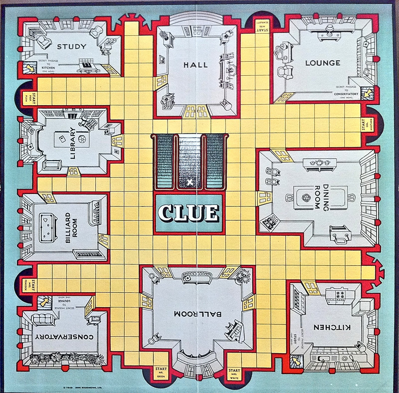

# Cluedo Mansion: A demonstration of a finite state machine

This is a demonstration of the capabilities of the flutter_finite_state_machine package.

## Overview

This is a simple flutter program to explore the Cluedo mansion:

At each moment, you are in a room: the program will show a plan of  the room, along with the exits to other rooms.

## Getting Started

The program defines the mansion using a finite state machine.  

- The states of the machine are `Room`s.  
- The properties for each room are:
  - The name of the room;
  - For each of north, south, east, west, and via a tunnel: which room (if any) that exit leads to;
  - If there are any actions which should appear on the app bar.

Most of the map is perfectly straightforward, but there are some additional features you should be aware of:

- The map is not entirely authentic.  This hasn't modelled the corridors,  but it does allow you access to the staircase.
- There is an additional room: **Landing**, accessible from the staircase.  You're not supposed to go upstairs!  So, Landing has some behaviour connected to `onEnterState ()`:
  - Each time you go upstairs, you lose a life.  
  - When your lives drop to zero, you get redirected to the dungeon!
- There is no room **Dungeon** in the map (they left it out of the plans!)  So, if you find yourself in the dungeon, `defaultProperties()` invents near-trivial properties: no exits (it's a dungeon after all) but there's an action that resets the app state.

### Suggestions for homework:

- Add new rooms.  Perhaps build some bedrooms;
- Rotate the title of the room, or add some room graphics;
- Rotate the view, so West, East, or South is up.  (Hint: use another state machine)
